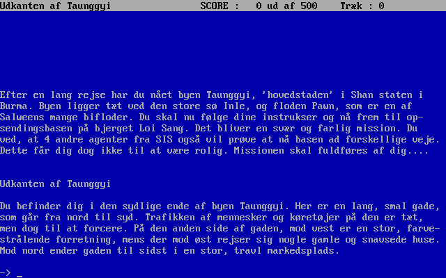

# Mystik i Burma
[English description available](README-EN.md).

Dette er et arkiv med den oprindelige sourcekode til det danske teksteventyrspil "Mystik i Burma", skrevet af Peter Ravnholt i 1990. Det blev skrevet i [Borland Turbo Pascal 5.5](http://progopedia.com/version/turbo-pascal-5.5/). Dette repository bliver holdt af historiske grunde (og en smule nostalgi).

* [BURMA.PAS](BURMA.PAS): Hovedprogrammet.
* [BUNIT.PAS](BUNIT.PAS): Hjælpebiblioteker.
* [PRSOUNDS.PAS](PRSOUNDS.PAS): Lyd-hjælpebiblioteker.
* [EDITOR.PAS](EDITOR.PAS): Hjælpeværktøj til at generere datafiler.
* .DAT-filer: Datafiler.
* [BURMA.TXT](BURMA.TXT): Hjælp og instruktioner til spillet.
* [MISSION.TXT](MISSION.TXT): Intro til spillets handling.
* [HISTORY.TXT](HISTORY.TXT): Opdigtede hovedbegivenheder i verden fra år 2000 og frem, som baggrund for handlingen. Meget underholdende læsning (og tankevækkende rigtigt ramt i flere tilfælde).

[Besøg FableTree Production's nostalgiside](https://fabletreeproductions.dk/da/nostalgia) for mere information og mulighed for at køre spillet i browseren.